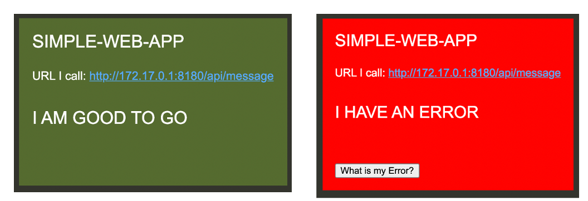
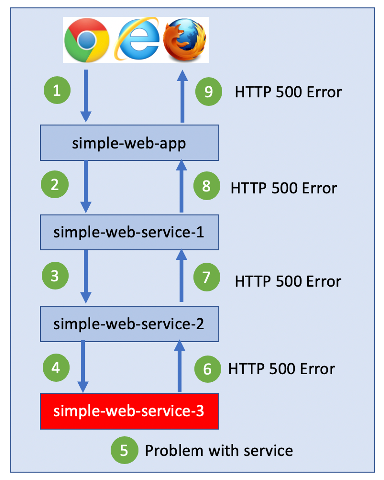
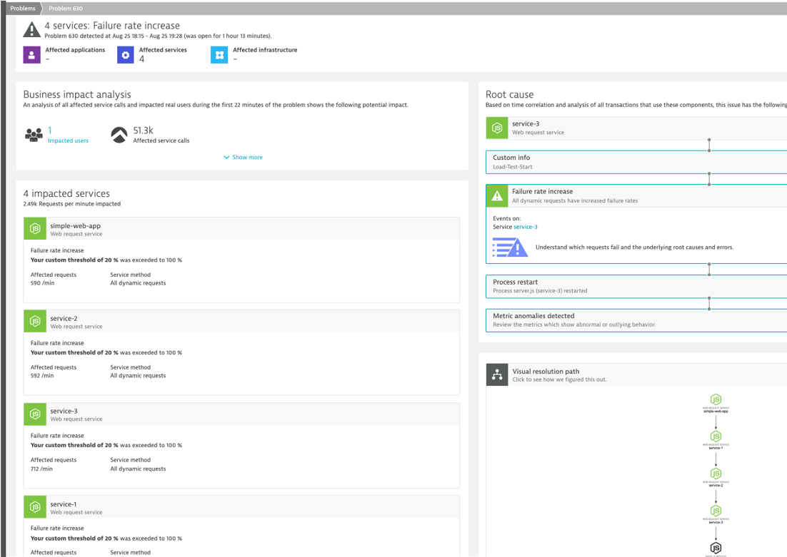

# Overview

This repo contains the code and scripts to build and test a simple web application and web services for demos. Both the web app and the services can be configured to create a chain of calls.  Each service has an endpoint `/api/message` that will return JSON information about who it is, what is calls, and the result of the call it makes.  The service response will also pass back the complete chain of calls made as shown below.

If the web app can reach the URL it is configured with, then the UI will show green.  If there is an error reaching it, then it will show red.

There is an option to view the final JSON data in the web app by pass in any query string value.

The primary use case is to show problems in the chain of service calls. In the example below, service-3 has a problem and the error propogate back to the web UI.

By having Dynatrace OneAgent, the impacted services and root cause will be found.

