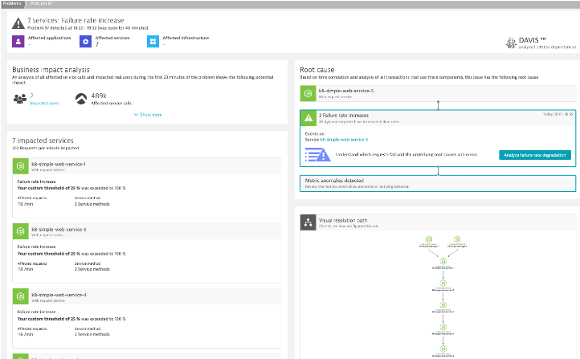
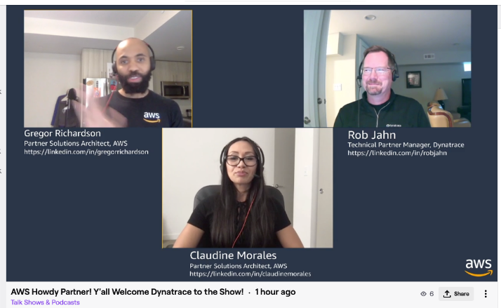
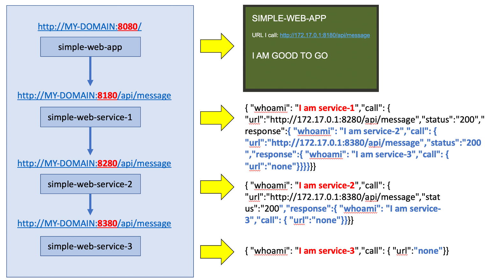
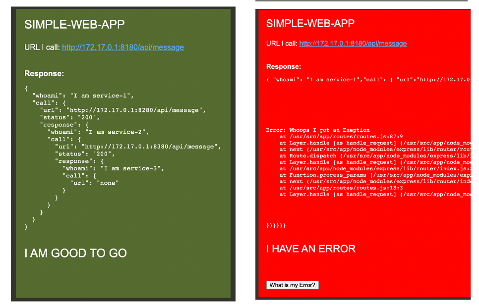

# Overview

This repo contains the code and scripts to build and test a simple web application and web services for demos. 

The primary use case is to show problems in the chain of service calls. In the example below, service-3 has a problem and the error propogate back to the web UI.

By having Dynatrace OneAgent, the impacted services and root cause will be found.

# Demo

Watch this [Howdy Partner Twitch Episode](https://www.twitch.tv/videos/743201902?collection=VV23gbfLCRbZLg) to see it in action!!

# Demo App Internals

Both the simple-web-app and the simple-web-service can be configured with a `SERVICE_TO_CALL_URL` environment variable that defines the simple-web-service it calls.  This value can be set to the `none` or to some URL. 

Each simple-web-service has an endpoint `/api/message` that will return JSON information about who it is, what the results of what it calls.  

By configuring the simple-web-app `SERVICE_TO_CALL_URL` to a simple-web-service endpoint `/api/message` and then configuring that simple-web-service `SERVICE_TO_CALL_URL` to call another simple-web-service's endpoint `/api/message`, a chain of calls can be defined.  In this example, the simple-web-app creates a chain to three simple-web-services.

## simple-web-app

If the simple-web-app can reach the `SERVICE_TO_CALL_URL` it is configured with or if `SERVICE_TO_CALL_URL` is set to `none`, then the UI will show green.  If there is an error reaching the `SERVICE_TO_CALL_URL`, then it will show red and return an HTTP 500 error.

See the [simple-web-app README](simple-web-app/README.md) for more details.

## simple-web-service

See the [simple-web-service README](simple-web-service/README.md) for more details.

# Usage

Assumes you have a Dynatrace tenant monitoring the application.  The application can be running on a VM or on Kubernetes.

See the [scripts README](scripts/README.md) for more details for now to deploy.
