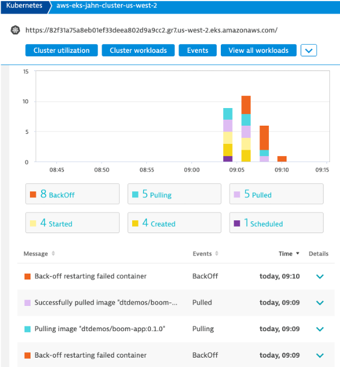
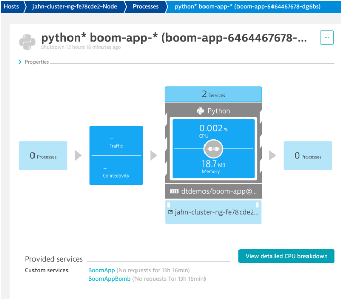
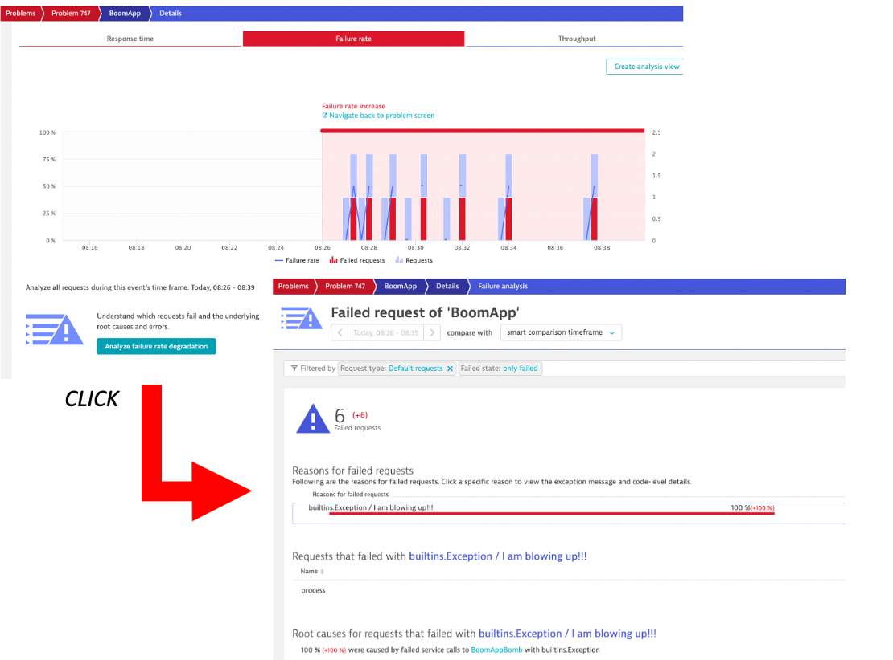

# Overview

Dockerized application to show Kubernetes pod crashes for demos. 

In the Dynatrace Kubernetes dashboard, these events will look like this:



Validate by running these commands:

```
kubectl -n demo-app-dev get pods -l app=boom-app -w
```

Kubectl output shows the pod crashing and restarting

```
NAME                        READY   STATUS             RESTARTS   AGE
boom-app-6464467678-xhnq7   1/1     Running            1          45s
boom-app-6464467678-xhnq7   0/1     Error              1          78s
boom-app-6464467678-xhnq7   0/1     CrashLoopBackOff   1          90s
boom-app-6464467678-xhnq7   1/1     Running            2          93s
boom-app-6464467678-xhnq7   0/1     Error              2          2m9s
boom-app-6464467678-xhnq7   0/1     CrashLoopBackOff   2          2m23s
boom-app-6464467678-xhnq7   1/1     Running            3          2m36s
boom-app-6464467678-xhnq7   0/1     Error              3          3m14s
boom-app-6464467678-xhnq7   0/1     CrashLoopBackOff   3          3m24s
boom-app-6464467678-xhnq7   1/1     Running            4          3m56s
boom-app-6464467678-xhnq7   0/1     Error              4          4m34s
boom-app-6464467678-xhnq7   0/1     CrashLoopBackOff   4          4m44s
boom-app-6464467678-xhnq7   1/1     Running            5          6m2s
boom-app-6464467678-xhnq7   0/1     Error              5          6m39s
boom-app-6464467678-xhnq7   0/1     CrashLoopBackOff   5          6m53s
boom-app-6464467678-xhnq7   1/1     Running            6          9m23s
boom-app-6464467678-xhnq7   0/1     Error              6          10m
```

# Deploy

Assuming you have Kubernetes, run these commands to start the app.

```
kubectl apply -f boom-app.yaml -n demo-app-dev
```

# Clean up

To remove the pod, run this command

```
kubectl -n demo-app-dev delete deploy boom-app
```

# Internals

The application is written in Python and instrumentes with the [Dynatrace Python SDK](https://github.com/dynatrace-oss/OneAgent-SDK-Python-AutoInstrumentation).  

Be sure to read [End-to-end request monitoring for popular Python frameworks with OneAgent SDK blog](https://www.dynatrace.com/news/blog/end-to-end-request-monitoring-for-popular-python-frameworks-with-oneagent-sdk/) to learn more about the Dynatrace Python SDK.

The app has two instrumented Python classes (BoomApp and BoomAppBomb) that will showup in Dyntrace as two services.



This is the internal sequence of classes and methods called.  

`BoomApp.process() --> BoomApp.callUrl() --> BoomApp.callUrl() --> BoomApp.callUrl() --> BoomAppBomb.boom()`

The `BoomAppBomb.boom()` method will throw an exception every 30 seconds that will crash the application.  The exception will look like this in Dynatrace. And you can analyze the failures.



# Build

Use the ```buildpush.sh``` script to build and push the image as `dtdemos/boom-app:0.1.0`.

# Run Locally

Use this command to run from code assuming you have python 3.7

```
python script.py
```
